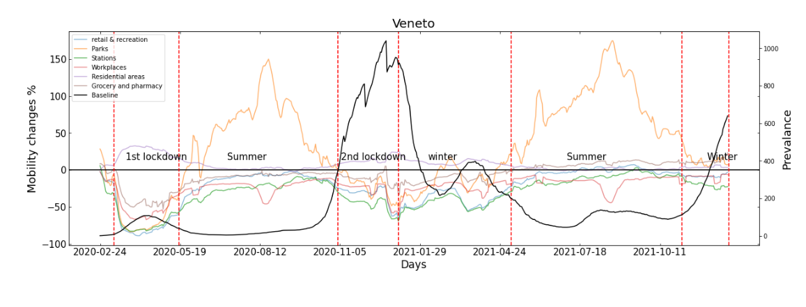
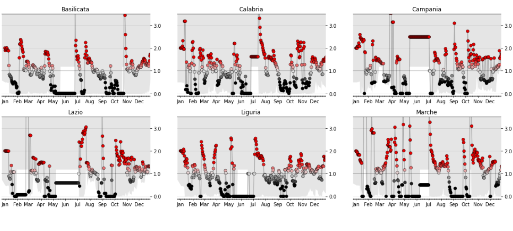
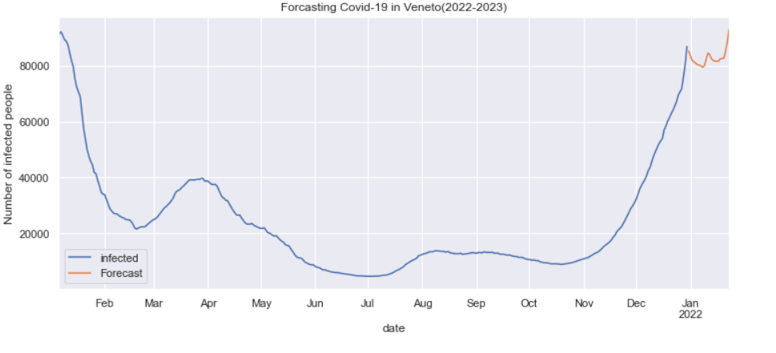

# Life Data Epidemiology

## Project: Human mobility and COVID-19 epidemic

This project is divided into 3 parts:

#### 1. Exploration of the Relationship between Mobility Patterns and the Dissemination of COVID-19:
Investigating the impact of restrictions and health advisories on the outbreak dynamics, this phase aims to discern the intricate interplay between human mobility and the transmission of COVID-19. The analysis will shed light on the effectiveness of implemented measures in curbing the spread of the virus.
 

#### 2. Calculation of the Reproductive Ratio Rt and Comparative Analysis with Empirical Data:
This stage involves the computation of the Reproductive Ratio (Rt) as a crucial epidemiological metric. The calculated Rt will be systematically compared against real-world data, providing insights into the alignment of theoretical models with observed patterns in the spread of COVID-19. This comparative analysis contributes to the validation and refinement of our predictive models.
 
#### 3. Application of Statistical Methodology (ARIMA) for COVID-19 Spread Prediction in Italian Regions:
Leveraging the Autoregressive Integrated Moving Average (ARIMA) statistical method, this phase aims to predict the future trajectory of COVID-19 spread within the regions of Italy. The application of ARIMA provides a rigorous and data-driven approach to forecasting, contributing valuable insights for strategic planning and response efforts.
 
This structured approach ensures a comprehensive and systematic investigation into the dynamics of COVID-19 spread, encompassing the examination of mobility patterns, calculation of epidemiological metrics, and the application of advanced statistical methodologies for predictive modeling.

#### Available data on human mobility/collocation: 
- Pepe, Bajardi, Gauvin, Privitera, Lake, Cattuto, Tizzoni, Scientific Data, 230 (2020) 
- COVID-19 Community Mobility Reports (https://www.google.com/covid19/mobility/) 
- Apple mobility trends reports (https://covid19.apple.com/mobility) 
- Available data on the epidemic in Italy: covid19.infn.it/iss
